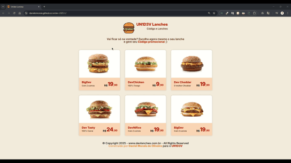

# 🍔 UN1D3V Lanches – Desafio Front-End

Este é um projeto desenvolvido para o desafio **UN1D3V 2025.1**, com o objetivo de praticar a criação de interfaces modernas usando ferramentas do desenvolvimento web, no meu caso utilizei apenas **HTML** e **CSS**. A proposta foi construir um cardápio digital de lanches com visual atrativo, responsivo e com ênfase em boas práticas de estruturação e estilização.

🔗 Acesse online: [danielomorais.github.io/unidev-2025.1](https://danielomorais.github.io/unidev-2025.1)

---

## 🎥 Demonstração em Vídeo



---

## 🧾 Sobre o Projeto

A página apresenta um menu fictício de lanches voltado ao público dev, com nomes como **BigDev**, **DevCheddar** e **DevNífico**. Cada item é exibido em um **card individual**, com:

- Imagem do lanche
- Nome criativo
- Descrição curta
- Preço destacado

---

## 🖥️ Tecnologias Utilizadas

- **HTML5**
- **CSS3 (Flexbox + Media Queries)**
- Estrutura semântica
- Estilização com foco em responsividade
- Layout limpo e alinhado com o tema

---

## 💡 Funcionalidades

- Cards com hover suave e alinhamento responsivo
- Layout adaptável a diferentes tamanhos de tela
- Rodapé com créditos e copyright
- Frase de chamada promocional no topo

---

## 📱 Responsividade

O layout foi pensado para **funcionar bem em dispositivos móveis** e telas maiores, utilizando **Flexbox** com media queries para adaptar a disposição dos cards.

---

## 📂 Como Rodar Localmente

1. Clone o repositório:
   ```bash
   git clone https://github.com/danielomorais/unidev-2025.1.git

2. Acesse a pasta do projeto:
    ```bash 
    cd unidev-2025.1

3. Abra o arquivo **`index.html`** no navegador ou utilize o Live Server no VS Code.

---

## 🧠 Aprendizados

- Organização visual com Flexbox
- Estruturação com HTML semântico
- Aplicação de responsividade com media queries
- Valorização da identidade visual com cores e fontes
- Organização de código limpo e modular

---

### 🧑🏽‍💻 Autor

Desenvolvido por <b>Daniel Morais de Oliveira</b> <br>
Desafio proposto por UN1D3V 2025.1

---

### 📜 Licença

Projeto sob a licença MIT. Sinta-se à vontade para estudar, modificar e utilizar!